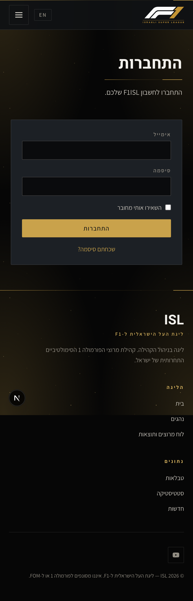
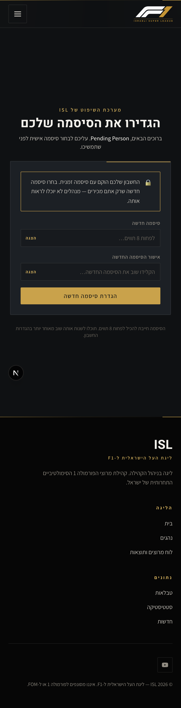
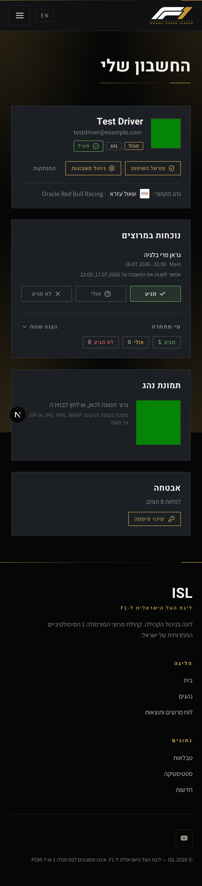
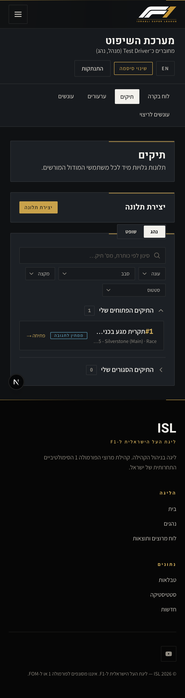
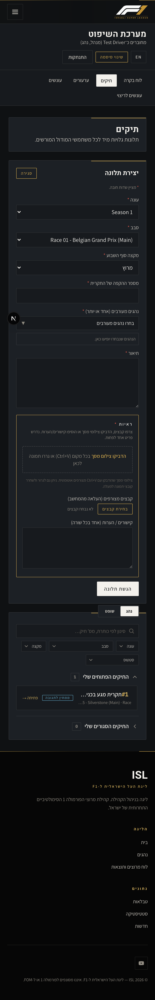
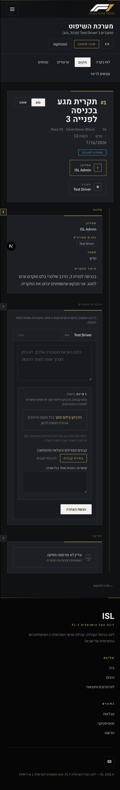
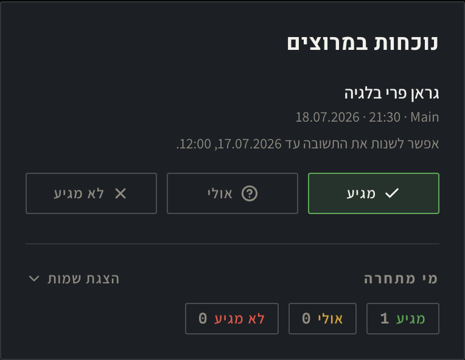

# הודעות הסבר לוואטסאפ (עברית)

שלושה מדריכים מוכנים להעתקה לוואטסאפ. כל מדריך הוא הודעה נפרדת.
צילומי המסך לצירוף נמצאים בתיקייה `whatsapp-shots/` ומשובצים כאן לנוחות.

---

## הודעה 1 — איך מגישים תלונה?

התלונות מוגשות רק דרך פורטל השיפוט באתר. אין טופס פתוח וצריך חשבון.

אם זו הפעם הראשונה שלכם (משתמש חדש):
1. קיבלתם מייל עם סיסמה זמנית. אם לא קיבלתם — פנו להנהלת הליגה כדי שיפתחו לכם חשבון.
2. היכנסו ל־f1isl.com/login והתחברו עם האימייל והסיסמה הזמנית.
3. בפעם הראשונה תתבקשו לבחור סיסמה אישית חדשה (לפחות 8 תווים). זה חד־פעמי.

אם כבר יש לכם חשבון (משתמש קיים):
1. היכנסו ל־f1isl.com/login והתחברו כרגיל.

הגשת התלונה:
1. מהתפריט למעלה: "החשבון שלי" ואז "פורטל השיפוט" (או "שיפוט").
2. עברו ללשונית "תיקים".
3. לחצו "יצירת תלונה".
4. מלאו את השדות: עונה, סבב, מקצה סוף השבוע, מספר ההקפה (במקצה דירוג — הזמן שנותר), נהגים מעורבים ותיאור.
5. ראיות: חובה לצרף לפחות פריט אחד — אפשר להדביק צילום מסך עם Ctrl+V, להעלות קובץ או להוסיף קישור.
6. לחצו "הגשת תלונה". תקבלו אישור ומייל אישור.

שימו לב: אפשר להגיש תלונה רק זמן קצר אחרי המרוץ. אם החלון נסגר תראו הודעה "חלון התלונות נסגר".

מסך התחברות:

בחירת סיסמה אישית בכניסה הראשונה:

עמוד החשבון — כניסה לפורטל השיפוט:

לשונית התיקים וכפתור יצירת תלונה:

טופס יצירת תלונה:

---

## הודעה 2 — איך מגיבים לתלונה?

אם הוגשה נגדכם תלונה, תקבלו מייל. את התגובה מגישים דרך האתר — לא עונים למייל.

1. במייל בנושא "Response required" לחצו על הכפתור "Submit Response".
   (אל תשיבו למייל עצמו — הוא לא נקרא.)
2. אם התבקשתם — התחברו לחשבון.
3. בעמוד התיק גללו לשלב "הצהרות הנהגים".
4. תחת השם שלכם (מסומן "אתם") כתבו את ההצהרה. שימו לב: ההצהרה סופית ולא ניתן לערוך אחרי ההגשה.
5. אפשר לצרף ראיות (רשות): צילומי מסך, קבצים או קישורים.
6. לחצו "הגשת הצהרה".

אפשר גם להגיע לתיק בלי המייל: "פורטל השיפוט" ← "תיקים" ← "התיקים הפתוחים שלי" ← "פתיחה".

עמוד התיק וטופס ההצהרה:

---

## הודעה 3 — איך משתמשים במערכת הנוכחות? (החל מהמרוץ שאחרי בלגיה)

לפני כל מרוץ מעדכנים אם אתם מתחרים. זה עוזר להנהלה לתכנן את הסבב.

1. היכנסו ל־f1isl.com/account (או "החשבון שלי" ← "פרופיל").
2. מצאו את הכרטיס "נוכחות במרוצים" — מופיע שם המרוץ הקרוב והתאריך.
3. לחצו על אחת מהתשובות: "מגיע" / "אולי" / "לא מגיע". התשובה נשמרת מיד.
4. אפשר לשנות את התשובה כל עוד החלון פתוח.

מתי אפשר לעדכן: החלון נפתח אחרי המרוץ הקודם ונסגר ב־12:00 ביום שלפני המרוץ. אחרי שהוא נסגר לא ניתן לשנות.

אם אינכם רואים את כפתורי התשובה — סימן שהחשבון עדיין לא מקושר לפרופיל הנהג שלכם. פנו להנהלה כדי לקשר אותו.

כרטיס הנוכחות:

